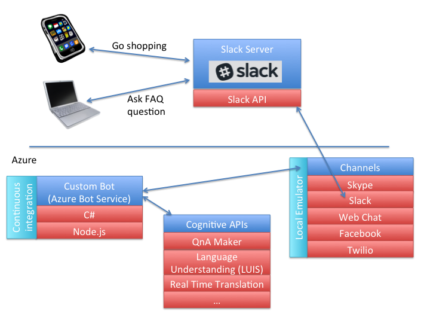

# Davidson Machine Learning Chatbot - Node #

The Charlotte/Davidson community in North Carolina has come together to develop an intelligent chatbot to assist our slack channel. You can help develop features and work with Azure Machine Learning, Google Tensorflow, etc. Please see the information below on how to contribute.

### How to Use ###

This chatbot is hosted via Azure for our slack channel and remotely communicates to our server for tensorflow processing. Please join our Slack channel #dml_chatbot for active development of the bot.  For an invite please contact us at [https://machinelearning.group/] .  

## Current Chatbot Functions ##

1) Q&A answering using Q&A maker.
example text:
'faq Where do we meet' 

2) New member greeter.
When a new member enters channel, they are presented with icebreaker questions

## Future Ideas for the Bot ##

Contribute ideas for the bot here: [https://github.com/DavidsonMachineLearningGroup/Davidson-ChatBot-Project/issues/1/]

### High level instructions for setting up your development environment ###

This chatbot is hosted via Azure for our slack channel and remotely communicates to our server for tensorflow processing. Please join our Slack channel #dml_chatbot for active development of the bot.  For an invite please contact us at [https://machinelearning.group/] .  

1.  download the emulator for your operating system: [https://emulator.botframework.com/]
2.  download Visual Code for your operating system: [https://code.visualstudio.com/download] (Note: you can use other IDE’s at your own descrection, all directions here will be in visual code)
3.  clone project locally from this github repository  
4.  load project in Visual Studio Code
5.  install all required node packages specified in messages/package.json (e.g. 'npm install messages')
6.  change **messages/index.js** devnode variable to ‘debugWithEmulator’
7.  launch debugger within Visual Code
8.  launch emulator
9.  connect with emulator and set breakpoints as needed (e.g. copy test bot endpoint from Visual Code to emulator)
10. when submitting, change devnode variable back to 'prod'.  Submit to branch 'DebugBotBranch' if using the test bot.  Once tested and ready for the production bot, submit to 'Master'

### High Level Overview ###

### Website, Other Links ###
Website: [https://machinelearning.group/](https://machinelearning.group/)
Meetup: [https://www.meetup.com/Davidson-Machine-Learning-Meetup/](https://www.meetup.com/Davidson-Machine-Learning-Meetup/)

### Authors ###
[Machine Learning Group Member: Phillipe Loher](https://www.linkedin.com/in/phillipe-loher-7b66911/)
[Machine Learning Group Member: Pon Arun Kumar Ramalingam](https://www.linkedin.com/in/ponarunkumar/)
[Machine Learning Group Member: Richard Brosius](https://www.linkedin.com/in/richard-brosius-3a7162b4/)
[Machine Learning Group Member: Sam Sharma](https://www.linkedin.com/in/thesamsharma/)
[Machine Learning Group Member: Max McCann](https://www.linkedin.com/in/max-mccann-96843a84/)

### License ###

The MIT License
Permission is hereby granted, free of charge, to any person obtaining a copy of this software and associated documentation files (the "Software"), to deal in the Software without restriction, including without limitation the rights to use, copy, modify, merge, publish, distribute, sublicense, and/or sell copies of the Software, and to permit persons to whom the Software is furnished to do so, subject to the following conditions:

The above copyright notice and this permission notice shall be included in all copies or substantial portions of the Software.

THE SOFTWARE IS PROVIDED "AS IS", WITHOUT WARRANTY OF ANY KIND, EXPRESS OR IMPLIED, INCLUDING BUT NOT LIMITED TO THE WARRANTIES OF MERCHANTABILITY, FITNESS FOR A PARTICULAR PURPOSE AND NONINFRINGEMENT. IN NO EVENT SHALL THE AUTHORS OR COPYRIGHT HOLDERS BE LIABLE FOR ANY CLAIM, DAMAGES OR OTHER LIABILITY, WHETHER IN AN ACTION OF CONTRACT, TORT OR OTHERWISE, ARISING FROM, OUT OF OR IN CONNECTION WITH THE SOFTWARE OR THE USE OR OTHER DEALINGS IN THE SOFTWARE.
